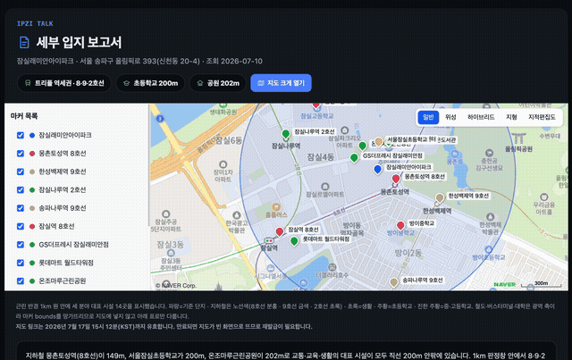
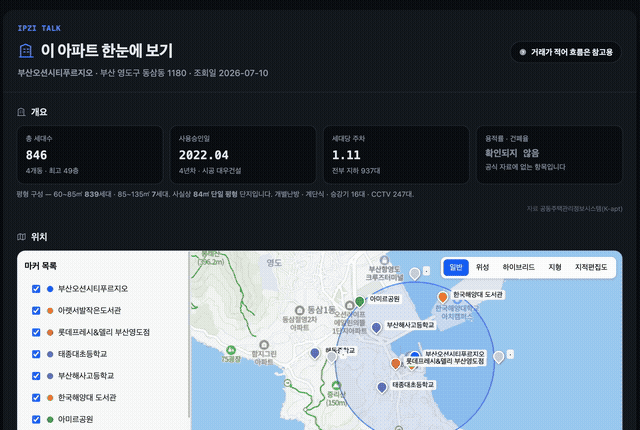
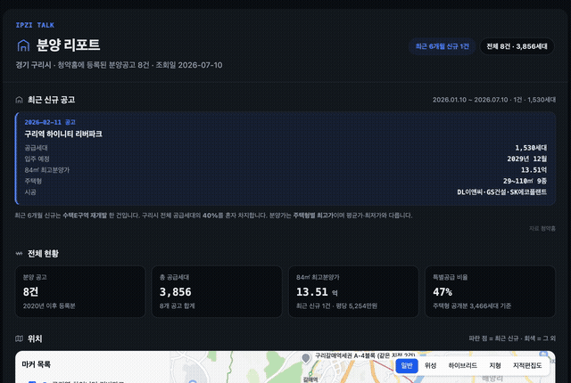
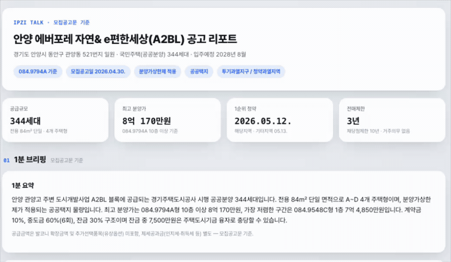
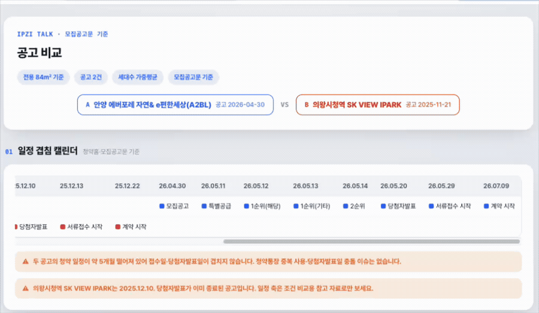

# Ipzi Talk (입지톡)

> 부동산 **분양·청약·입지 분석**을 채팅으로 한 줄 말하면 자동으로 해주는 클로드 코드 플러그인이에요.
> “풍무역 반경 3km내 아파트 단지 비교해줘”, "OO시 최근 분양 공고는?", “수원시 영통구에 분양 예정인 아파트 조사해줘”라고 입력하면 공공데이터 및 카카오 지도 데이터를 끌어와 대답해 줍니다.
**[입지톡 공식 URL](https://ipzi-talk.synergylabs.kr)에서 자세한 소개를 보실 수 있어요**


---

## 이게 뭔가요? (1분 요약)

- **무엇을 하는 도구:** 글로만 지시해도 부동산 분양·청약·입지 분석을 자동으로 해주는 도구예요.
- **누가 쓰면 좋은가:** 분양대행사·시행사·광고대행사·중개사·내집마련 준비 중인 누구나 — **부동산 데이터 찾기 지겨운 모든 사람.**
- **어떻게 쓰는가:** 클로드 코드(또는 클로드 데스크탑) 안에서 **한국어로 말하듯** 요청하면 됩니다. 개발 지식도, 명령어 암기도 필요 없어요.

**예시 한 줄:**

> "동탄 힐스테이트 아파트 입지 종합 분석해줘."

↓ 2~3분 후 ↓

→ 교통·생활·교육 환경을 종합한 **입지 리포트 + 인근 시설 지도**가 담긴 HTML 파일이
생성됩니다.

---

## 무엇이 들어있나요 — MCP 1개 + 스킬 27종

입지톡은 두 가지가 한 세트로 움직입니다.

- **MCP 서버** — 청약홈 분양공고, K-apt 단지 정보, 국토부 실거래가, 카카오/네이버 지도 같은
  **부동산 원천 데이터**를 실시간으로 조회하는 도구입니다.
- **스킬 27종** — "지역을 넣으면 → 분양현황 리포트 완성", "아파트명만 넣으면 → 입지분석 완료" 같은 **완성된 자동화 플로우**입니다. 당신은 스킬 이름과 목적만 말하면 됩니다.

> **추가 설명:**
>
> - **MCP 서버**: AI(Claude/Codex)에 설치하는 '앱 또는 크롬 확장 프로그램'과 비슷합니다. '도구' 또는 '앱' 또는 '커넥터' 라는 이름으로 불리기도 합니다.
> - **스킬(Skill)**: "이런 요청이 오면 이렇게 일해라"를 적어 둔 작업 설명서. AI가 이걸 읽고 전문가처럼 순서대로 처리합니다. 없으면 그냥 일반 AI가 대충 대답할 뿐이에요.

---

## 처음 설치하는 분을 위한 준비

Ipzi Talk 입지톡은 **Claude Code** 안에서 동작합니다. "명령줄에서 쓰는 AI 비서"라고 생각하시면 돼요. 실행 방식은 두 가지 중 하나를 **한 번만** 고르면 됩니다.


| 실행 모드         | 무엇                                                                   | 준비물                  |
| ------------------- | ------------------------------------------------------------------------ | ------------------------- |
| **Remote (권장)** | 입지톡 서버에 접속. 데이터·API 키 걱정 없이 27종 스킬 전체 사용.      | 카카오 회원가입         |
| **OSS (로컬)**    | `presale-mcp`를 내 컴퓨터에서 직접 실행. MCP 도구 10종만, 스킬은 없음. | Node.js 18+, API 키 4개 |

> 빠르게 설치해서 써보고 싶다면, **Remote**를 추천드립니다. 스킬 27종도 함께 제공해드립니다. OSS는 내 컴퓨터에 직접 설치하는 버전이라 설치가 조금 까다롭습니다.

### Claude Code에서 설치

Claude Code CLI 채팅창에 순서대로 입력하세요:

```
/plugin marketplace add chatdaeri/ipzitalk
```

```
/plugin install ipzitalk@ipzitalk
```

```
/reload-plugins
```

```
/ipzitalk:setup
```
그 다음 2가지 버전 중 하나를 골라 안내에 따라 진행하면됩니다.

**중요** : 설치가 끝나면 클로드를 한번 완전 종료 후 켜주세요.

> * 클로드 데스크탑 또는 ChatGPT를 사용하는 경우, 다음 링크에 따라 설치해주세요:
> * [클로드 데스크탑 or ChatGPT / Codex 연결방법](https://ipzi-talk.synergylabs.kr#Quickstart)

---

## 쓰는 법 — 채팅창에 말만 걸면 끝

설치·선택이 끝나면, 그냥 **한국어로 원하는 걸 설명**하세요.

AI가 입지톡 MCP로 데이터를 조회해 바로 대답해줍니다:

입지톡 MCP에 포함된 11개 도구:


| 도구                        | 기능                                                         | 예시 프롬프트                      |
| ----------------------------- | -------------------------------------------------------------- | ------------------------------------ |
| `get_geocode`               | 도로명/지번 주소 → 위도·경도 좌표 (카카오 법정동코드 보강) | "서초구 방배동 424-28 좌표 찾아줘" |
| `get_address`               | 단지명·장소명 → 카카오 주소 후보(좌표 포함)                | "반포자이 주소 어디야?"            |
| `get_region_code`           | 주소·지역명 → 법정동코드·시군구코드·청약홈 지역코드      | "구리시 지역코드 알려줘"           |
| `search_by_nearby_category` | 좌표 주변 카테고리 시설(학교·지하철·마트 등) 검색          | "이 좌표 주변 지하철역 찾아줘"     |
| `search_by_nearby_keyword`  | 좌표 주변 키워드 검색(아파트·오피스텔·도서관 등)           | "이 주변 아파트 단지 검색해줘"     |
| `search_announcement_info`  | 청약홈 분양공고 + 주택형·분양가를 한 번에 조회              | "동탄 최근 분양공고 찾아줘"        |
| `enrich_complex_info`       | 아파트 후보에 K-apt 단지 정보(세대수·연식·주차 등) 보강    | "이 단지들 세대수·연식 채워줘"    |
| `get_complex_info`          | K-apt 단지 기본/상세(주차·승강기·교통 등) 조회             | "반포자이 단지 정보 알려줘"        |
| `get_complex_trades`        | 국토부 실거래가(매매·전월세·분양권) 조회                   | "이 단지 최근 실거래가 보여줘"     |
| `get_static_map`            | 네이버 정적 지도 이미지(마커·중심·반경) 생성               | "이 위치 지도 이미지로 보여줘"     |
| `get_map_embed_url`         | 마커·반경을 담은 공유용 인터랙티브 지도 URL 생성            | "이 단지들 지도 링크 만들어줘"     |

## 스킬 27종 카탈로그

Remote 버전으로 설치하셨다면 27개의 자동화 기능(스킬)도 추가로 지원됩니다.

전부 '목표 맞춤화'기능이 탑재가 되어 있어서 내 목적에 맞는 결론부터 바로 볼 수 있어요.

> 실행은 Claude `/스킬이름 [입력]`, 또는 그냥 자연어로 하면 됩니다.
> 평소엔 "이 아파트 역세권이야?", "여기 학군 어때?"처럼 **목적만** 말해도 알아서 골라줘요.

---

## ⭐ 메인 스킬 6종

### 1. 세부 입지 보고서 — `ipzitalk-location-report`



- **언제:** 특정 주소·아파트의 입지를 종합적으로 분석하고 싶을 때
- **예시 프롬프트:** `방배롯데캐슬아르떼 세부입지 분석해줘` · `서초구 방배동 424-28 입지보고서 만들어줘`
- **결과물:** 교통·생활·교육을 한 번에 종합한 입지분석 보고서. `html` / `pptx` / `docx` 형식 선택 가능.

### 2. 이 아파트 한눈에 보기 — `ipzitalk-complex-overview-all`



- **언제:** 한 아파트의 단지 개요·실거래·주변 입지·경쟁단지까지 한 번에 보고 싶을 때
- **예시 프롬프트:** `부산 영도 오션시티푸르지오 한눈에 보여줘` · `이 아파트 전반적으로 알려줘`
- **결과물:** 단지 개요·최근 12개월 실거래·주변 입지·입주 예정 단지·인근 단지가 담긴 종합 HTML 보고서.

### 3. 분양 리포트 — `ipzitalk-presale-report`



- **언제:** 특정 지역의 신규 분양공고·물량을 지도와 함께 훑고 싶을 때
- **예시 프롬프트:** `구리시 분양 현황 알려줘` · `구리시 요즘 분양 뭐 있어`
- **결과물:** 최근 6개월 신규 공고 + 등록 전체 물량을 KPI·지도·입주 타임라인·공급유형·전용면적·연도별 물량으로 정리한 HTML 보고서.

### 4. 청약홈 공고 상세 분석 — `ipzitalk-read-notice-report`



- **언제:** 특정 단지 모집공고 PDF를 깊게 뜯어보고 싶을 때
- **예시 프롬프트:** `안양 에버포레 공고 상세 분석해줘` · `이 공고 자금 타임라인과 제한사항 정리해줘`
- **결과물:** 공식 공고문 기준 1분 브리핑·청약 일정·자금 조달 타임라인·제한사항이 담긴 `result.html` + 근거 `backdata.xlsx`. 원문에 없는 값은 추정하지 않고 `공고문 원문 확인 필요`로 표기.

### 5. 청약홈 공고 비교 — `ipzitalk-read-notice-compare`



- **언제:** 2~4개 단지 모집공고 PDF를 나란히 비교하고 싶을 때
- **예시 프롬프트:** `안양 에버포레와 평촌 자이 공고 비교해줘` · `두 청약 일정이 겹치는지 비교해줘`
- **결과물:** 공고 2~4건의 일정 겹침·계약금/중도금/잔금·전매제한/거주의무/재당첨제한을 나란히 보여주는 `result.html` + `backdata.xlsx`.

### 6. 최근 시장동향 — `ipzitalk-recent-market-trend`

- **언제:** 여러 시·군·구의 최근 거래량·중위 평당가·중위 거래가를 전월과 비교하고 싶을 때
- **예시 프롬프트:** `노원구·도봉구·강북구 최근 시장동향 비교해줘` · `요즘 어느 구의 거래가 늘었어?`
- **결과물:** 지역별 거래량·중위 평당가·중위 거래가의 전월 대비 변화를 정리한 HTML 보고서. (최근 1~2개월은 신고 지연으로 제외, 참고 신호로만 활용)

---

## 서브 스킬 21종

메인 스킬의 한 분야만 빠르게 보거나 특정 조건으로 좁혀볼 때 쓰는 보조 스킬이에요.

**🔎 청약 공고 찾기 (5종)**

- `ipzitalk-find-region` — 이 지역의 청약 공고 찾기
- `ipzitalk-find-nearby` — 이 주소 반경 3km 내 청약 공고 찾기
- `ipzitalk-find-commute` — 회사 반경 5km 내 청약 공고 찾기
- `ipzitalk-find-fit` — 내 소득·현금 기준 청약 공고 선별하기
- `ipzitalk-announcement-search` — 청약 공고 원하는 조건으로 찾기

**📍 입지 (분야별, 8종)**

- `ipzitalk-subway-proximity` — 역세권 분석하기
- `ipzitalk-transit-environment` — 지하철+KTX+터미널 교통 종합 분석하기
- `ipzitalk-education-environment` — 학교·학원 교육 환경 분석하기
- `ipzitalk-elementary-proximity` — 초품아 판별하기
- `ipzitalk-living-environment` — 상권·공원·공공기관 분석하기
- `ipzitalk-hospital-proximity` — 병세권 판별하기
- `ipzitalk-retail-proximity` — 쇼세권 판별하기
- `ipzitalk-park-proximity` — 숲세권 판별하기

**🏢 단지 정보 (K-apt, 5종)**

- `ipzitalk-complex-overview` — 특정 아파트 단지 정보 한 장 요약
- `ipzitalk-complex-spec-card` — 단지 스펙 상세·비교표 만들기
- `ipzitalk-parking-ranking` — 세대당 주차 순위 확인하기
- `ipzitalk-transit-complex-ranking` — 역까지 거리 순위 확인하기
- `ipzitalk-building-age-analysis` — 노후도 분포 확인하기

**💰 분양·실거래 (2종)**

- `ipzitalk-presale-compare-card` — 분양단지 카드·비교하기
- `ipzitalk-price-trend` — 단지 월별 실거래·평당가 추이 확인하기

**🧰 워크플로우 (1종)**

- `ipzitalk-presale-kit` — 직접 부르는 스킬이 아니라 위 스킬들이 공통으로 지키는 규약 모음

### 이름이 비슷해서 헷갈리는 스킬들


| 헷갈리는 스킬                                         | 어떻게 다른가요                                                                         |
| ------------------------------------------------------- | ----------------------------------------------------------------------------------------- |
| `read-notice-compare` vs `presale-compare-card`       | 전자는**공고문 PDF 원문**(일정·자금·제한) 비교, 후자는 **DB 등록 가격·세대수** 비교  |
| `read-notice-report` vs `presale-report`              | 전자는 공고**1개를 깊게**, 후자는 지역 기준 **최근 신규 + 등록 전량** 훑기              |
| `location-report` vs 단일 입지 스킬                   | 전자는 교통+생활+교육**종합**, 후자는 그중 **한 분야만**                                |
| `complex-overview` vs `-spec-card` vs `-overview-all` | **개요 한 장** → **스펙 상세/비교** → **실거래·입지까지 전부**. 뒤로 갈수록 무거워요 |
| `price-trend` vs `recent-market-trend`                | 전자는**단지 하나**의 월별 추이, 후자는 **시군구 여러 곳**의 전월 대비                  |

---

## 자주 묻는 질문

**Q. 코딩 한 번도 안 해봤는데 괜찮나요?**
A. 네, **전혀 필요 없어요.** Claude Code 또는 Codex만 설치하면 전부 한국어 대화로 끝납니다.

**Q. Remote랑 OSS 중 뭘 골라야 하나요?**
A. 스킬 27종을 전부 쓰고 싶으면 **Remote**. 데이터를 내 컴퓨터에서 직접 통제하고 싶은
개발자라면 **OSS**(MCP 도구 10종, 스킬 없음). 둘을 동시에 켜지는 마세요.

**Q. OSS를 쓰려면 무슨 키가 필요한가요?**
A. 카카오 REST API 키, 네이버 지도 Client ID/Secret, data.go.kr 서비스 키 —
총 4개입니다. 이 값들은 **절대 채팅·명령어·설정 파일에 붙여넣지 마세요.**
Claude Code는 보안 저장소(userConfig)로, Codex는 프로세스 환경변수로만 전달합니다.

**Q. 결과물을 편집·공유할 수 있나요?**
A. 네, 표준 **HTML 파일**이에요. 브라우저로 열어 확인하고, 그대로 고객·팀에 공유하거나
PDF로 저장하면 됩니다.

**Q. 데이터는 안전한가요?**
A. OSS 모드는 조회가 **여러분 컴퓨터에서** 이뤄집니다. Remote 모드는 챗대리 호스팅 서버를
OAuth로 이용합니다. (단, AI 응답을 받기 위해 대화 내용은 Anthropic 서버로 전달됩니다.
회사 보안 정책에 따라 판단해 주세요.)

---

## 이 플러그인은 어떻게 구성되어 있나요?

```
ipzitalk/
├── .claude-plugin/            ← 마켓플레이스 명함 (3개 플러그인 등록)
├── plugins/
│   ├── ipzitalk/              ← ★ 런처: Remote/OSS를 고르는 setup 스킬
│   ├── ipzitalk-remote/       ← ★ 호스팅 MCP + 스킬 27종
│   └── ipzitalk-local/        ← OSS presale-mcp (MCP 도구 10종, 스킬 없음)
├── docs/                      ← 플랫폼별 설치·전환·제거 가이드
├── scripts/                   ← 패키지 검증 스크립트
└── source-lock.json           ← 스킬·MCP 소스 버전 고정
```

**핵심 세 가지:**

- **`ipzitalk` (런처)** — 설치하면 가장 먼저 실행하는 `setup` 스킬. Remote와 OSS 중
  하나를 고르게 하고, 상태를 점검하고, 전환·제거까지 안내합니다.
- **`ipzitalk-remote`** — 호스팅 MCP(`https://ipzi-talk.synergylabs.kr/mcp`)와
  스킬 27종이 담긴 본체. 대부분의 사용자가 실제로 쓰는 부분이에요.
- **`ipzitalk-local`** — 오픈소스 `presale-mcp`를 내 컴퓨터에서 실행하는 MCP-only 모드.

세 플러그인이 한 마켓플레이스로 묶여 있고, 런처가 그중 하나만 활성화하도록 관리합니다.

---

## 문의

- **버그 리포트·스킬 제안:** GitHub 이슈 환영합니다
- **도입·제휴 문의:** [synergylabs.kr](https://synergylabs.kr)

---

## 라이선스

### 오픈소스 구성요소

이 저장소에 포함된 다음 구성요소는 [MIT License](./LICENSE)에 따라 제공됩니다.

- `plugins/ipzitalk`
- `plugins/ipzitalk-local`
- `plugins/ipzitalk-remote`에 포함된 Skill 및 클라이언트 설정
- 저장소에 포함된 설치 스크립트와 문서

### 입지톡 Remote 서비스

입지톡 Remote MCP 서버의 백엔드 소스 코드, 데이터 인프라 및 호스팅 서비스는 이 저장소에
포함되지 않으며 MIT License의 적용 대상이 아닙니다.

입지톡 Remote MCP 서비스의 이용 권한, 사용 제한, 계정, 요금, 데이터 및 서비스 운영에 관한
사항은 입지톡 서비스 이용약관을 따릅니다.

Copyright © 2026 Synergy Labs. All rights reserved for the hosted service and
server-side components not included in this repository.
